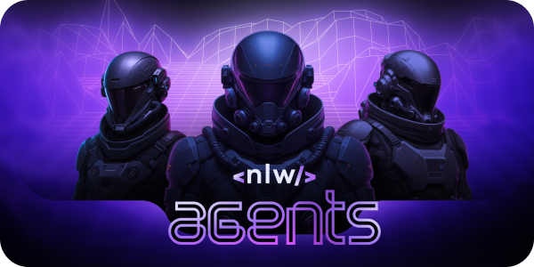

<p align="center">
  
</p>

# LetMeAsk NLW Agents

Sistema de perguntas e respostas com transcrição e análise de áudio, dividido em dois projetos: **WEB** (frontend) e **SERVER** (backend).

---

## Sumário

- [WEB (Frontend)](#web-frontend)
  - [Estrutura de Pastas](#estrutura-de-pastas-web)
  - [Principais Bibliotecas e Ferramentas](#bibliotecas-e-ferramentas-web)
  - [Comandos](#comandos-web)
- [SERVER (Backend)](#server-backend)
  - [Estrutura de Pastas](#estrutura-de-pastas-server)
  - [Principais Bibliotecas e Ferramentas](#bibliotecas-e-ferramentas-server)
  - [Rotas da API](#rotas-da-api)
  - [Comandos](#comandos-server)

---

## WEB (Frontend)

### Estrutura de Pastas

```markdown
web/
├─ public/
├─ src/
│ ├─ app.tsx
│ ├─ main.tsx
│ ├─ index.css
│ ├─ pages/
│ │ ├─ create-room.tsx
│ │ ├─ record-room-audio.tsx
│ │ └─ room.tsx
│ ├─ components/
│ │ ├─ create-room-form.tsx
│ │ ├─ question-form.tsx
│ │ ├─ question-item.tsx
│ │ ├─ question-list.tsx
│ │ ├─ room-list.tsx
│ │ └─ ui/
│ ├─ http/
│ │ ├─ use-create-question.ts
│ │ ├─ use-create-room.ts
│ │ ├─ use-room-questions.ts
│ │ ├─ use-rooms.ts
│ │ └─ types/
│ ├─ lib/
│ │ ├─ dayjs.ts
│ │ └─ utils.ts
└─ ...
```

### Principais Bibliotecas e Ferramentas

- **React** (`react`, `react-dom`)
- **React Router** (`react-router-dom`)
- **React Hook Form** (`react-hook-form`, `@hookform/resolvers`)
- **Tailwind CSS** (`tailwindcss`, `@tailwindcss/vite`, `tailwind-merge`)
- **TanStack React Query** (`@tanstack/react-query`)
- **Zod** (validação de schemas)
- **Dayjs** (datas)
- **Lucide React** (ícones)
- **Vite** (build e dev server)
- **TypeScript**
- **Biome** (lint)

### Comandos

No diretório `web/`:

```bash
# Instalar dependências
npm install

# Rodar em modo desenvolvimento
npm run dev
```

---

## SERVER (Backend)

### Estrutura de Pastas

```
server/
  ├─ src/
  │  ├─ server.ts
  │  ├─ env.ts
  │  ├─ db/
  │  │  ├─ connection.ts
  │  │  ├─ seed.ts
  │  │  ├─ schema/
  │  │  └─ migrations/
  │  ├─ http/
  │  │  └─ routes/
  │  │     ├─ create-room.ts
  │  │     ├─ get-rooms.ts
  │  │     ├─ create-question.ts
  │  │     ├─ get-room-questions.ts
  │  │     └─ upload-audio.ts
  │  └─ services/
  │     └─ gemini.ts
  ├─ docker-compose.yml
```

### Principais Bibliotecas e Ferramentas

- **Fastify** (API HTTP)
- **Zod** (validação de schemas)
- **Drizzle ORM** (`drizzle-orm`, `drizzle-kit`, `drizzle-seed`)
- **Postgres** (banco de dados)
- **@google/genai** (integração com IA)
- **@fastify/cors**, **@fastify/multipart** (CORS e upload de arquivos)
- **Biome** (lint)
- **Docker** (para ambiente de banco de dados)

### Rotas da API

#### `POST /rooms`

Cria uma nova sala.

- **Body:** `{ name: string, description?: string }`
- **Response:** `{ roomId: string }`

#### `GET /rooms`

Lista todas as salas.

- **Response:** `[{ id, name, createdAt, questionsCount }]`

#### `POST /rooms/:roomId/questions`

Cria uma nova pergunta em uma sala, gera resposta automática se possível.

- **Body:** `{ question: string }`
- **Response:** `{ questionId: string, answer: string | null }`

#### `GET /rooms/:roomId/questions`

Lista as perguntas de uma sala.

- **Response:** `[{ id, question, answer, createdAt }]`

#### `POST /rooms/:roomId/audio`

Faz upload de um áudio, transcreve e armazena embeddings.

- **Body:** arquivo de áudio (multipart)
- **Response:** `{ chunkId: string }`

### Comandos

No diretório `server/`:

```bash
# Instalar dependências
npm install

# Rodar em modo desenvolvimento
npm run dev

# Rodar em produção
npm start

# Gerar e rodar migrações do banco de dados
npm run db:generate
npm run db:migrate

# Popular banco de dados com dados iniciais
npm run db:seed
```

> **Obs:** Para rodar o backend, é necessário um banco de dados Postgres. Você pode utilizar o `docker-compose.yml` para subir o ambiente rapidamente:

```bash
docker-compose up -d
```

---

## Observações

- Certifique-se de configurar as variáveis de ambiente necessárias em ambos os projetos.
- A integração entre frontend e backend é feita via HTTP, utilizando as rotas documentadas acima.
